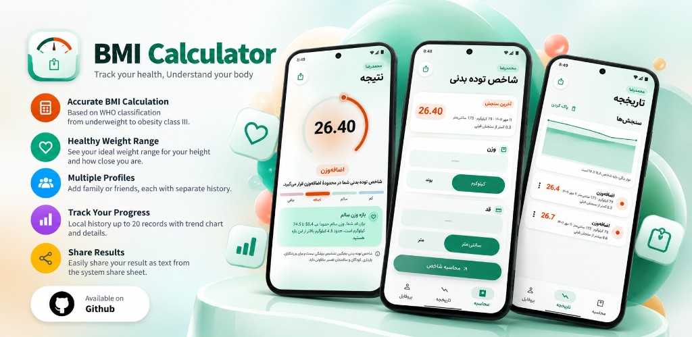

# BMI Calculator

Track your health. Understand your body.

<p align="center">
  
</p>

BMI Calculator is an open-source Flutter app for adult and youth body-mass readings. Enter weight and height, see a WHO-aligned result, compare it with a healthy weight range for that height, and keep a short history on the device. The interface is Persian and right-to-left. Nothing leaves the phone: there is no account, no network, and no ads.

**[View on GitHub](https://github.com/mrmzee/bmi_calculator)**

## Features

| | |
| --- | --- |
| **Accurate BMI** | Weight (kg) divided by height squared (m). Inputs are converted to metric before the formula runs. |
| **WHO classification** | Adult bands from severe thinness through obesity class III. Ages under 18 get youth copy instead of adult bands. |
| **Healthy weight range** | The 18.5–24.9 BMI window, expressed as kilograms for the height you entered. |
| **Multiple profiles** | Family or friends, each with a name, age (2–120), an optional goal weight, and a separate history. |
| **Progress** | Up to 20 readings per profile, stored locally, with a trend chart and per-entry detail. |
| **Share** | Send the result as text through the system share sheet. |
| **Units** | Kilograms or pounds; centimeters or meters. |
| **Theme and layout** | Light and dark themes follow the system. Narrow screens stack; wide screens sit side by side. |

Input is rejected when a field is empty, not numeric, the weight is outside 2–500 kg, or the height is outside 50 cm–2.5 m.

## Getting started

**Prerequisites**

- [Flutter](https://docs.flutter.dev/get-started/install) on the stable channel
- Dart SDK `>=3.0.0 <4.0.0` (see `pubspec.yaml`)
- Android Studio or VS Code

This repository is set up for Android, iOS, and web.

```bash
git clone https://github.com/mrmzee/bmi_calculator.git
cd bmi_calculator
flutter pub get
flutter run
```

Web:

```bash
flutter run -d chrome
```

Tests cover the calculation, validation, healthy range, age interpretation, history, profiles, and the calculator screen:

```bash
flutter test
```

## Architecture

The app is organized as **feature-first Clean Architecture** with an **MVVM** presentation layer. Calculation rules live in plain Dart. Flutter is confined to `presentation`, `app`, and `design_system`.

**Layers.** Each feature (`bmi`, `profile`) is split into three layers:

- **Domain** holds entities, use cases, and repository contracts. It does not import Flutter. `CalculateBmi`, `ValidateMeasurements`, `ComputeHealthyWeightRange`, and `InterpretBmi` are the BMI rules. Profiles are a separate feature with their own entity and repository contract.
- **Data** implements those contracts with on-device storage. `LocalBmiHistoryRepository` and `LocalProfileRepository` sit on small local services backed by `shared_preferences`. Corrupt rows are skipped instead of wiping the store. History is capped at 20 entries per profile.
- **Presentation** is MVVM. `BmiViewModel` and `ProfileViewModel` extend `ChangeNotifier` and publish immutable state. Views and widgets only render that state and forward user actions.

**Dependency direction.** Presentation calls use cases and repository interfaces. Data implements the interfaces. Domain depends on neither. `main.dart` is the composition root: it constructs the concrete repositories and use cases and passes them into the view models. There is no service locator.

**Navigation.** `go_router` owns the route table. A redirect keeps an incomplete profile on setup, then opens the tab shell. `StatefulShellRoute` preserves the calculator, history, and profile tabs. A result route sits above the shell so a reading can open without losing the tab stack.

**Design system.** Color, type, spacing, motion, and Persian date formatting live under `lib/design_system` and are shared by both features. Feature themes (BMI status colors, dial size, breakpoints) stay next to the BMI screens.

```text
lib/
├── main.dart                      # Composition root
├── app/                           # MaterialApp, router, tab shell
│   ├── bmi_app.dart
│   ├── bmi_router.dart
│   └── bmi_shell.dart
├── design_system/                 # Tokens, theme, Persian dates
└── features/
    ├── bmi/
    │   ├── domain/                # Entities and use cases
    │   ├── data/                  # Local history repository
    │   └── presentation/          # Views, view models, widgets
    └── profile/
        ├── domain/
        ├── data/                  # Local profile repository
        └── presentation/
```

## Dependencies

| Package | Role |
| --- | --- |
| `flutter` | SDK and widget framework |
| `go_router` | Declarative routes, redirects, and the tab shell |
| `shared_preferences` | Profiles and BMI history on device |
| `share_plus` | System share sheet for a result |
| `cupertino_icons` | Cupertino icon set |
| `flutter_test` | Widget and unit tests |
| `flutter_lints` | Recommended analyzer rules |

## Branches

| Branch | Role |
| --- | --- |
| `main` | Stable, releasable history. Day-to-day work does not land here directly. |
| `dev` | Integration branch. Features are merged here first. |

A release is a merge from `dev` into `main`. A fix made on the released line is brought back to `dev`.

## Contributing

```bash
git checkout dev
git checkout -b feature/your-change
flutter test
git push -u origin feature/your-change
```

Open the pull request against `dev`. Bug fixes, UI polish, and clearer domain rules are all welcome. Keep Flutter out of `domain/`, and add a test when you change a use case or a repository.

## Medical disclaimer

Body mass index is not a medical diagnosis. Athletes, pregnancy, children, and older adults need a different reading. Adult results in this app follow WHO bands only. Under 18, the app does not apply those adult bands.

## Font

[Vazirmatn](https://github.com/rastikerdar/vazirmatn) is bundled under `assets/fonts/` under the SIL Open Font License 1.1. The license text is [`assets/fonts/OFL.txt`](assets/fonts/OFL.txt).

## License

The code is released under the [MIT License](LICENSE). Vazirmatn remains under its own license, linked above.
